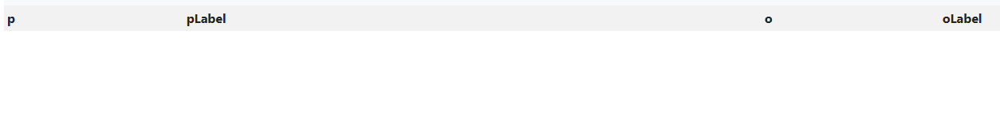

  <h3 style="text-align: center;">Sections:</h3>

  <a href="index.html">Home</a> |
  <a href="topic.html">Topic</a> |
  <a href="methodology.html">Methodology</a> |
  <a href="sparql.html">SPARQL Results</a> |
  <a href="gaps.html">Identifying Gaps</a> |
  <a href="llms.html">LLM Prompts</a> |
  <a href="rdf-enrichment.html">RDF Triples</a> |
  <a href="vocabulary-extension.html">Vocabulary Extension</a> |
  <a href="challenges.html">Challenges</a> |
  <a href="conclusion.html">Conclusion</a>

<h1>How We Identified the Information Gaps</h1>

  This section explains how we identified the main information gaps in the ArCo representation of <strong>Tempio Malatestiano</strong>.

  The analysis was based on the comparison between the information directly represented in the RDF description of the main resource and the information that appears indirectly in related photographic resources.

  The selected ArCo resource is:

<pre><code>https://w3id.org/arco/resource/ArchitecturalOrLandscapeHeritage/0800163046
  </code></pre>

<h2>1. Identification of the First Gap</h2>

<h3>Missing structured links to internal architectural components</h3>

  The first gap concerns the internal architectural structure of <strong>Tempio Malatestiano</strong>.

  The aim was to verify whether the internal chapels of the monument are directly represented as construction elements of the main architectural resource.

  To check this, we used the property <code>cdesc:hasConstructionElement</code>, which is used to connect a cultural heritage resource to its construction elements.

<h3>Query 3 — Checking existing construction elements</h3>

<pre><code>PREFIX rdfs: &lt;http://www.w3.org/2000/01/rdf-schema#&gt;
PREFIX cdesc: &lt;https://w3id.org/arco/ontology/construction-description/&gt;

SELECT DISTINCT ?element ?elementLabel
WHERE {
  VALUES ?cp { &lt;https://w3id.org/arco/resource/ArchitecturalOrLandscapeHeritage/0800163046&gt; }

  ?cp cdesc:hasConstructionElement ?element .

  OPTIONAL { ?element rdfs:label ?elementLabel . }
}
ORDER BY ?elementLabel
LIMIT 100
</code></pre>

<h3>Result</h3>

<a href="assets/images/q3.png" target="_blank">
  Open screenshot of Query 3 results
</a>

  The query returned only one construction element:

  <code>https://w3id.org/arco/resource/Facade/0800163046-1</code>

  Its labels are:

<ul>
  <li><code>Facade 1 of cultural property: 0800163046</code></li>
  <li><code>Facciata 1 del bene culturale: 0800163046</code></li>
</ul>

<h3>Interpretation</h3>

  This result shows that, in the direct RDF description, <strong>only the facade is explicitly modeled as a construction element</strong> of Tempio Malatestiano. However, the monument is architecturally more complex and contains several internal chapels. Therefore, we needed to check <strong>whether these elements appeared elsewhere</strong> in the ArCo data.

<h3>Query 4 — Looking for internal chapels in photographic resources</h3>

  Since the direct RDF description returned only the facade as a construction element, we analysed the photographic resources linked to <strong>Tempio Malatestiano</strong> through <code>rdfs:seeAlso</code>. In this query the purpose was to verify whether internal chapels are mentioned in the labels of related photographic resources. Moreover, we used <code>UNION</code> to compare two types of information in one query:

<ul>
  <li>construction elements directly connected to the main Tempio Malatestiano resource;</li>
  <li>internal chapels mentioned only in the labels of related photographic resources.</li>
</ul>

  The purpose of the query was to verify whether internal architectural elements are explicitly modeled as construction elements or only indirectly mentioned in photographic resource labels.

<pre><code>PREFIX rdfs: &lt;http://www.w3.org/2000/01/rdf-schema#&gt;
PREFIX cdesc: &lt;https://w3id.org/arco/ontology/construction-description/&gt;

SELECT ?source ?elementName (COUNT(DISTINCT ?item) AS ?numberOfResources)
WHERE {
  VALUES ?cp { &lt;https://w3id.org/arco/resource/ArchitecturalOrLandscapeHeritage/0800163046&gt; }

  {
    ?cp cdesc:hasConstructionElement ?item .
    BIND("Direct construction element" AS ?source)
    BIND("Facade" AS ?elementName)
  }

  UNION

  {
    ?cp rdfs:seeAlso ?item .
    ?item rdfs:label ?photoLabel .

    BIND("Photographic resource label" AS ?source)

    BIND(
      IF(REGEX(STR(?photoLabel), "Cappella degli Antenati", "i"), "Cappella degli Antenati",
      IF(REGEX(STR(?photoLabel), "Cappella degli Angeli", "i"), "Cappella degli Angeli",
      IF(REGEX(STR(?photoLabel), "Cappella delle Virt", "i"), "Cappella delle Virtù / S. Sigismondo",
      IF(REGEX(STR(?photoLabel), "Cappella dello Zodiaco", "i"), "Cappella dello Zodiaco",
      IF(REGEX(STR(?photoLabel), "Cappella d.Isotta", "i"), "Cappella d'Isotta",
      ""))))) AS ?elementName
    )

    FILTER(?elementName != "")
  }
}
GROUP BY ?source ?elementName
ORDER BY ?source DESC(?numberOfResources)
</code></pre>

<h3>Result</h3>

<a href="assets/images/q4.png" target="_blank">
  Open screenshot of Query 4 results
</a>

<table>
  <thead>
    <tr>
      <th>Source</th>
      <th>Architectural element</th>
      <th>Number of resources</th>
    </tr>
  </thead>
  <tbody>
    <tr>
      <td>Direct construction element</td>
      <td>Facade</td>
      <td>1</td>
    </tr>
    <tr>
      <td>Photographic resource label</td>
      <td>Cappella delle Virtù / S. Sigismondo</td>
      <td>54</td>
    </tr>
    <tr>
      <td>Photographic resource label</td>
      <td>Cappella dello Zodiaco</td>
      <td>43</td>
    </tr>
    <tr>
      <td>Photographic resource label</td>
      <td>Cappella degli Angeli</td>
      <td>28</td>
    </tr>
    <tr>
      <td>Photographic resource label</td>
      <td>Cappella degli Antenati</td>
      <td>26</td>
    </tr>
    <tr>
      <td>Photographic resource label</td>
      <td>Cappella d'Isotta</td>
      <td>1</td>
    </tr>
  </tbody>
</table>

<h3>Final consideration for Gap 1</h3>

  The use of <code>UNION</code> makes it possible to compare structured RDF data and implicit textual information within the same query. The query results show that several internal chapels are repeatedly mentioned in the labels of photographic resources associated with Tempio Malatestiano, which means that the information exists in the ArCo dataset, but it is not represented at the right semantic level.
While the first part of the query retrieves the construction elements directly connected to the main <strong>Tempio Malatestiano</strong> resource through <code>cdesc:hasConstructionElement</code>; it returns only the <strong>facade</strong>.

  The result shows that several internal chapels, such as <strong>Cappella delle Virtù / S. Sigismondo</strong>, <strong>Cappella dello Zodiaco</strong>, <strong>Cappella degli Angeli</strong> and <strong>Cappella degli Antenati</strong>, are repeatedly mentioned in photographic resource labels.
Therefore, the first gap is confirmed: information about the internal architectural structure of the monument exists in ArCo, but it is not represented at the right semantic level.
The internal chapels are present only indirectly in textual labels, while the main architectural resource directly models only the facade as a construction element. 

To enrich the graph, we propose adding direct <code>cdesc:hasConstructionElement</code> relations from Tempio Malatestiano to the main internal chapels identified in the photographic resources.

<h2>2. Identification of the Second Gap</h2>

<h3>Missing structured links to historical and artistic entities</h3>

  The second gap concerns historical and artistic entities associated with <strong>Tempio Malatestiano</strong>.

  During the exploration of related photographic resources, we noticed that their labels mention several important figures and elements connected to the monument. These include historical persons, artistic objects and heraldic elements.

<h3>Query 5 — Finding historical and artistic entities in photographic resources</h3>

  This query was used to count how often selected historical and artistic entities appear in the labels of photographic resources linked to Tempio Malatestiano through <code>rdfs:seeAlso</code>.

<pre><code>PREFIX rdfs: &lt;http://www.w3.org/2000/01/rdf-schema#&gt;

SELECT ?entityName (COUNT(DISTINCT ?photo) AS ?numberOfPhotos)
WHERE {
  VALUES ?cp { &lt;https://w3id.org/arco/resource/ArchitecturalOrLandscapeHeritage/0800163046&gt; }

  ?cp rdfs:seeAlso ?photo .
  ?photo rdfs:label ?photoLabel .

  BIND(
    IF(REGEX(STR(?photoLabel), "Sigismondo Pandolfo Malatesta", "i"), "Sigismondo Pandolfo Malatesta",
    IF(REGEX(STR(?photoLabel), "Sigismondo Malatesta", "i"), "Sigismondo Malatesta",
    IF(REGEX(STR(?photoLabel), "Isotta degli Atti", "i"), "Isotta degli Atti",
    IF(REGEX(STR(?photoLabel), "San Sigismondo", "i"), "San Sigismondo",
    IF(REGEX(STR(?photoLabel), "Crocifisso giottesco", "i"), "Crocifisso giottesco",
    IF(REGEX(STR(?photoLabel), "stemma.*Malatesta|Malatesta.*stemma", "i"), "Stemma Malatesta",
    IF(REGEX(STR(?photoLabel), "statua di Sigismondo", "i"), "Statua di Sigismondo",
    ""))))))) AS ?entityName
  )

  FILTER(?entityName != "")
}
GROUP BY ?entityName
ORDER BY DESC(?numberOfPhotos)
</code></pre>

<h3>Result</h3>

<a href="assets/images/q5.png" target="_blank">
  Open screenshot of Query 5 results
</a>

<table>
  <thead>
    <tr>
      <th>Entity</th>
      <th>Number of photographic resources</th>
    </tr>
  </thead>
  <tbody>
    <tr>
      <td>Sigismondo Pandolfo Malatesta</td>
      <td>9</td>
    </tr>
    <tr>
      <td>Sigismondo Malatesta</td>
      <td>8</td>
    </tr>
    <tr>
      <td>Isotta degli Atti</td>
      <td>3</td>
    </tr>
    <tr>
      <td>Statua di Sigismondo</td>
      <td>2</td>
    </tr>
    <tr>
      <td>Stemma Malatesta</td>
      <td>2</td>
    </tr>
    <tr>
      <td>Crocifisso giottesco</td>
      <td>1</td>
    </tr>
  </tbody>
</table>

<h3>Interpretation</h3>

  The results show that several historical and artistic entities are present in the labels of photographic resources.

  The most relevant entities for the enrichment are:

<ul>
  <li><strong>Sigismondo Pandolfo Malatesta</strong></li>
  <li><strong>Isotta degli Atti</strong></li>
  <li><strong>Crocifisso giottesco</strong></li>
  <li><strong>Stemma Malatesta</strong></li>
</ul>

  However, at this stage, these entities were still found only in photographic labels. Therefore, we needed to verify whether they were already directly connected to the main Tempio Malatestiano resource.

<h3>Query 6 — Checking whether these entities are directly linked</h3>

  To verify whether the selected historical and artistic entities were already directly linked to the main architectural resource, we ran another query excluding <code>rdfs:seeAlso</code>.

  This was necessary because <code>rdfs:seeAlso</code> connects the monument to related photographic resources, but it does not directly express historical, artistic or symbolic relations.

<pre><code>PREFIX rdfs: &lt;http://www.w3.org/2000/01/rdf-schema#&gt;

SELECT DISTINCT ?p ?pLabel ?o ?oLabel
WHERE {
  VALUES ?cp { &lt;https://w3id.org/arco/resource/ArchitecturalOrLandscapeHeritage/0800163046&gt; }

  ?cp ?p ?o .

  OPTIONAL { ?p rdfs:label ?pLabel . }
  OPTIONAL { ?o rdfs:label ?oLabel . }

  FILTER(?p != rdfs:seeAlso)

  FILTER(
    REGEX(STR(?o), "Sigismondo", "i") ||
    REGEX(STR(?o), "Malatesta", "i") ||
    REGEX(STR(?o), "Isotta", "i") ||
    REGEX(STR(?o), "Giotto", "i") ||
    REGEX(STR(?o), "Crocifisso", "i") ||
    REGEX(STR(?o), "stemma", "i") ||
    REGEX(STR(?oLabel), "Sigismondo", "i") ||
    REGEX(STR(?oLabel), "Malatesta", "i") ||
    REGEX(STR(?oLabel), "Isotta", "i") ||
    REGEX(STR(?oLabel), "Giotto", "i") ||
    REGEX(STR(?oLabel), "Crocifisso", "i") ||
    REGEX(STR(?oLabel), "stemma", "i")
  )
}
ORDER BY ?p
LIMIT 100
</code></pre>

<h3>Result</h3>

  The query returned no results.

<h3>Final consideration for Gap 2</h3>

  The absence of results confirms that the <strong>selected historical and artistic entities are not directly connected</strong> to the main Tempio Malatestiano resource through structured RDF properties and they appear mainly in the labels of related photographic resources.

  To enrich the graph, we propose adding new RDF relations connecting Tempio Malatestiano to associated historical persons, artistic objects and heraldic elements.

<h2>Final conclusion</h2>

  The gap identification process showed that Tempio Malatestiano is well documented in ArCo, especially through photographic resources. However, some important information is only implicit. Internal chapels, historical figures, artistic objects and heraldic elements appear in textual labels, but they are <strong>not directly represented as RDF relations</strong> of the main architectural resource.

  The proposed enrichment therefore aims to transform this implicit textual information into explicit and machine-readable RDF triples.

  <a href="sparql.html">Previous</a>
  <a href="llms.html">Next</a>

