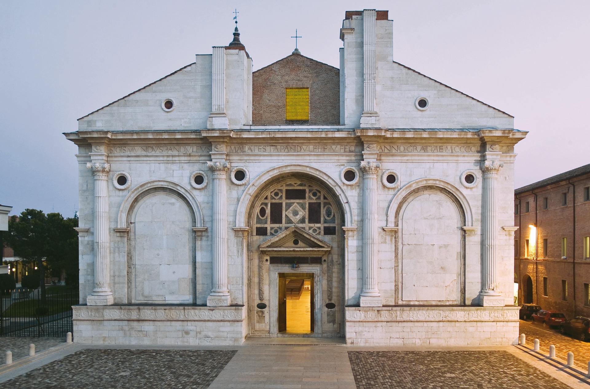

  <h3 style="text-align: center;">Sections:</h3>

  <a href="index.html">Home</a> |
  <a href="topic.html">Topic</a> |
  <a href="methodology.html">Methodology</a> |
  <a href="sparql.html">SPARQL Results</a> |
  <a href="gaps.html">Identifying Gaps</a> |
  <a href="llms.html">LLM Prompts</a> |
  <a href="rdf-enrichment.html">RDF Triples</a> |
  <a href="challenges.html">Challenges</a> |
  <a href="conclusion.html">Conclusion</a>

# Tempio Malatestiano

_A Renaissance monument in Rimini_

## Why Tempio Malatestiano?

**Tempio Malatestiano** is significant for several reasons. It is one of **the most important monuments in Rimini** and represents a complex example of cultural heritage where architecture, history, art and symbolic elements are closely connected.

The building is not only a church, but also a monument associated with Renaissance architectural culture, the Malatesta family, internal chapels, artistic objects and heraldic symbols. For this reason, it is a particularly interesting case for exploring how cultural heritage information is represented in a knowledge graph.

We selected **Tempio Malatestiano** for this project because:

- It is a complex architectural heritage object with several internal components.
- It is connected to important historical figures, such as Sigismondo Pandolfo Malatesta and Isotta degli Atti.
- It contains or is associated with artistic and symbolic elements, such as the Crocifisso giottesco and the Malatesta coat of arms.
- Its ArCo representation already includes useful information, especially through related photographic resources but some relevant information appears only indirectly in labels and is not represented as explicit RDF relations.

This makes **Tempio Malatestiano** a suitable case for a knowledge graph enrichment project. The resource is already documented in ArCo, but its semantic representation can be improved by making implicit information more explicit and machine-readable.

---

## Objectives

The main objectives of this project are:

- To explore the **ArCo knowledge graph** using the official SPARQL endpoint and identify information gaps.
- To **propose new RDF triples** that could enrich the ArCo Knowledge Graph.
- To use **Large Language Models**, such as ChatGPT and Gemini, to support the interpretation of the identified gaps and compare their outputs.

---

## Research Questions

<ul>
  <li>Which architectural components of Tempio Malatestiano are directly represented in ArCo?</li>
  <li>Which internal chapels appear only in photographic resource labels?</li>
  <li>Which historical and artistic entities are associated with Tempio Malatestiano but not directly linked to the main resource?</li>
  <li>Which RDF triples and vocabulary extensions could make this information explicit?</li>
</ul>

  <a href="index.html">← Previous</a>
  <a href="methodology.html">Next →</a>

